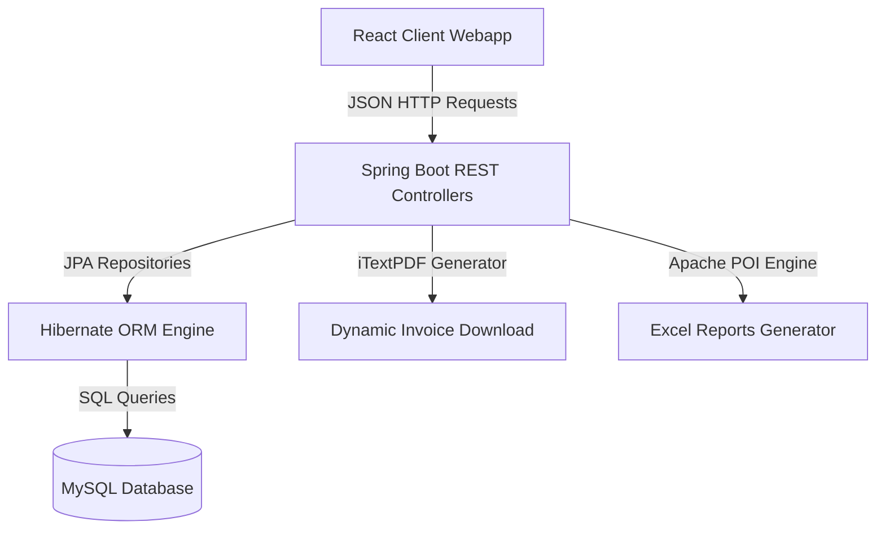
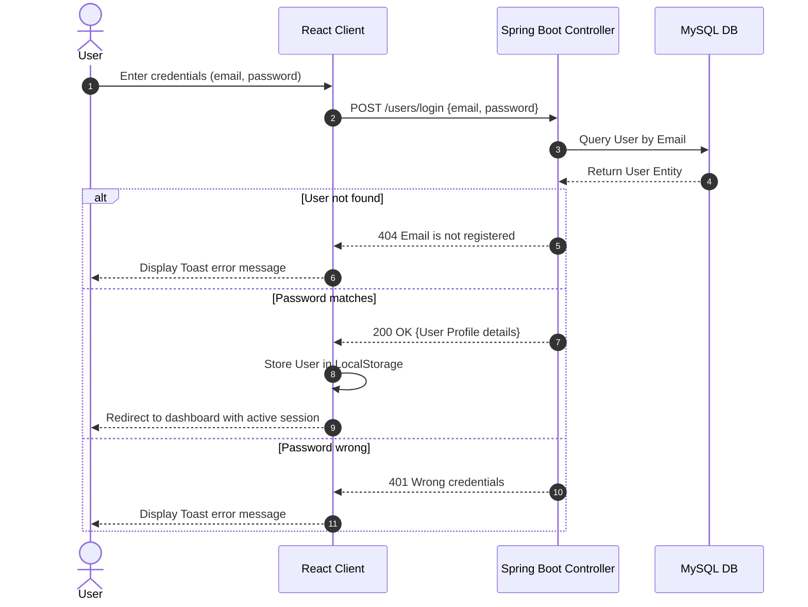
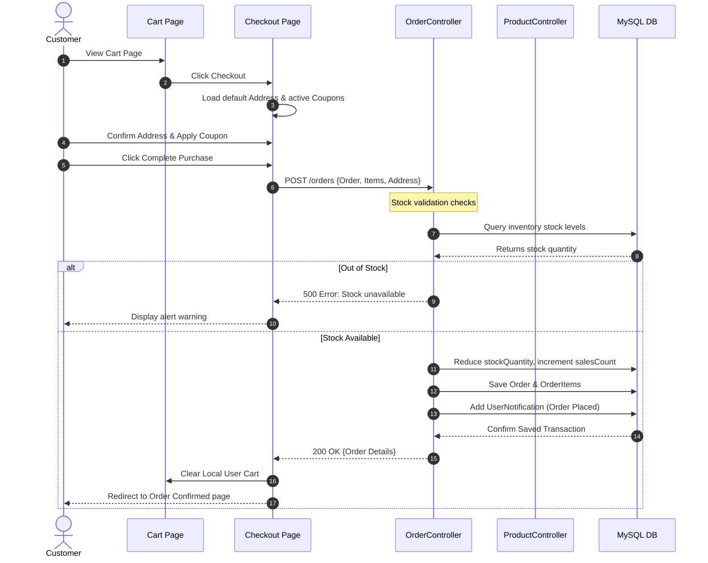
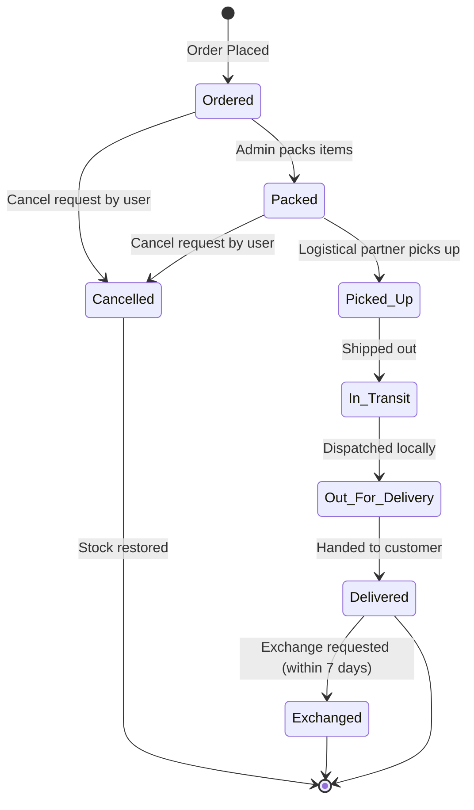
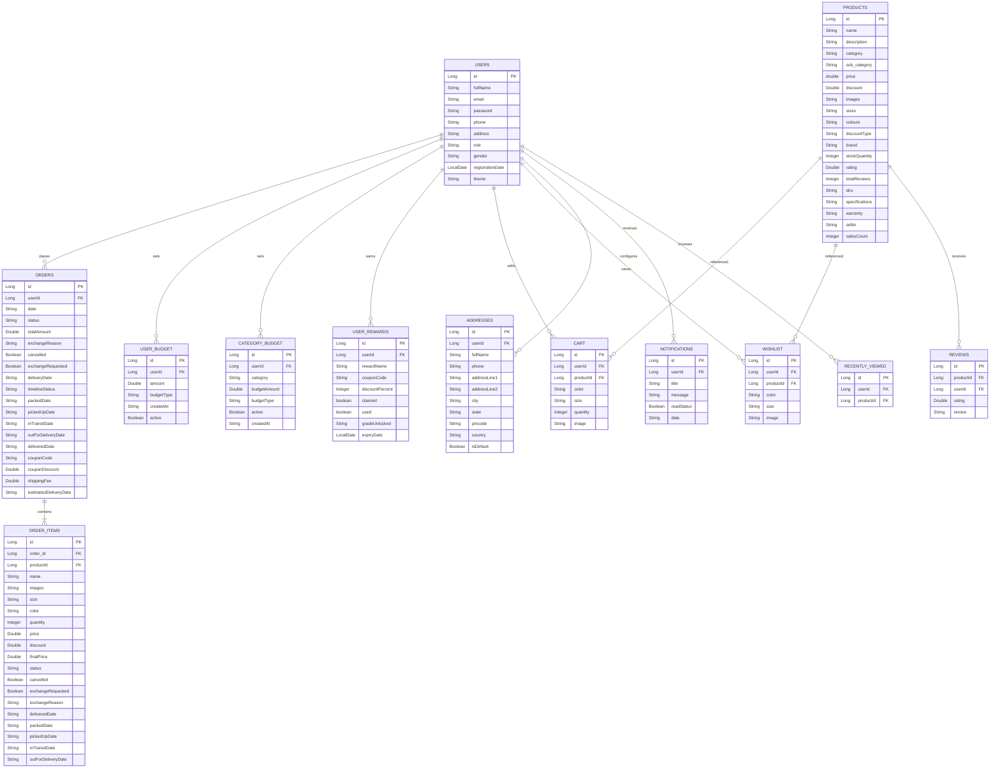

# 🧬 AI-Powered Smart Shopping Intelligence E-Commerce Platform

A production-grade, full-stack E-Commerce platform enhanced with algorithmic consumer intelligence, dynamic budget controllers, gamified milestone achievements, and granular transaction audit trails.

[](https://www.oracle.com/java/)
[](https://spring.io/projects/spring-boot)
[](https://react.dev/)
[](https://www.mysql.com/)
[](https://tailwindcss.com/)
[](https://opensource.org/licenses/MIT)

---

## 📋 Table of Contents
1. [Project Overview](#-project-overview)
2. [Core AI & Intelligence Modules](#-core-ai--intelligence-modules)
3. [System Architecture](#%EF%B8%8F-system-architecture)
4. [Folder Structure](#-folder-structure)
5. [Technology Stack](#-technology-stack)
6. [Database Schema & ERD](#-database-schema--erd)
7. [REST API Reference](#-rest-api-reference)
8. [Installation & Setup](#-installation--setup)
9. [Screenshots](#-screenshots)
10. [Security & Performance Optimizations](#-security--performance-optimizations)
11. [Future Enhancements](#-future-enhancements)
12. [Author](#-author)

---

## 🌟 Project Overview

Traditional e-commerce platforms focus solely on standard transactional flows (Add to Cart, Checkout, Pay). The **AI-Powered Smart Shopping Intelligence Platform** bridges the gap between transactions and financial wellness. It solves common digital shopping friction points:
* **Impulsive Spending**: Warns users and intercepts high-impact cart checkouts when limits are reached.
* **Lack of Personalization**: Instead of static suggestions, it compiles a dynamic **Shopping DNA Profile** based on active purchase history.
* **Underutilized Discounts**: Integrates a coupon validation eligibility engine that checks welcome rules, cart size constraints, and specific clothing categories.
* **Lack of Gamification**: Rewards responsible spending habits and brand loyalty using dynamic milestone achievements.

### Key Innovations:
1. **Rule-Based Algorithmic Engine**: Compiles customer shopping personality classifications and DNA health scores instantly based on actual database records.
2. **Checkout Budget Interceptor**: Inspects cart items, computes projected spending against active limits, and suggests which items to remove to stay under budget.
3. **Automated Transaction Documents**: Generates PDF Tax Invoices dynamically via `iTextPDF` and exports complex Excel reports (`Apache POI`) for orders, inventory, and monthly revenue.

---

## 🧠 Core AI & Intelligence Modules

### 1. 🧬 Shopping DNA Score
Calculates a numeric rating (0 to 100+) reflecting the user's spending health, and maps it to a academic grade (`S`, `A`, `B`, `C`, `D`):
* **Consistency Component (+20 max)**: Assesses purchase frequency.
* **Savings Component (+15 max)**: Rewards active usage of discounts (savings rate $\ge 10\%$ of total spend).
* **Brand Loyalty (+15 max)**: Evaluates purchase frequency from a preferred brand.
* **Category Diversity (+20 max)**: Encourages browsing across multiple categories (penalizes single-category concentration by `-25`).
* **Cancellation & Exchange Rates (+25 max)**: Penalizes high return and cancellation activity.
* **Spending Discipline (+15 max)**: Evaluates monthly spending growth rate.

### 2. 🎭 AI Shopping Personality
Profiles the user's buying archetype through behavioral metrics:
* **Tech Enthusiast**: Favorite category is *Electronics* and represents $\ge 50\%$ of purchases.
* **Fashion Explorer**: Favorite category is *Fashion* and represents $\ge 50\%$ of purchases.
* **Knowledge Seeker**: Focuses heavily on *Books*.
* **Impulsive Shopper**: Shopping frequency is less than 7 days.
* **Planned Buyer**: Evaluating period averages $\ge 20$ days between purchases.
* **Loyal Customer**: Reorders from the same brand $\ge 50\%$ of the time.
* **Budget Conscious**: Actively saves $\ge 10\%$ of total spend using coupons.
* **Premium Shopper**: Average order value is $\ge ₹5,000$.
* **Balanced Shopper**: Baseline profile for distributed shopping patterns.

### 3. 👛 Smart Budget Manager (Overall & Category-Specific)
Allows users to set financial boundaries:
* Set limits globally or for specific categories (e.g., Fashion, Electronics).
* Select cycles: **Weekly**, **Monthly**, or **Yearly**.
* Computes budget health parameters: `Safe` ($<75\%$), `Warning` ($\ge 75\%$), `Critical` ($\ge 90\%$), and `Exceeded` ($\ge 100\%$).

### 4. 🛒 Checkout Budget Interceptor
* Operates on the cart checkout page.
* Compares the current cart total + already spent amounts against the user's budget.
* If a budget violation occurs, it computes combination weights of cart items and recommends specific items to remove to bring the projected total back under the limit.

### 5. 🎟️ Coupon Eligibility Engine
Checks rules before applying discounts:
* **`WELCOME` Coupons**: Inspects the order database. If the user has a prior completed order, they are disqualified.
* **`FASHION` Coupons**: Inspects the cart items. Verifies at least one product belongs to clothing subcategories (`dress`, `top`, `shirt`, `jacket`, `jeans`, `kurti`, `skirt`).
* **Cart Minimums**: Restricts coupon use below a defined order value limit.

---

## 🛠️ System Architecture

The project follows a decoupled, three-tier architecture:
1. **Frontend Presentation Layer**: Built with React (SPA) using vanilla CSS variables, glassmorphism, Recharts, and React Router.
2. **Backend API Layer**: Java REST APIs powered by Spring Boot, mapping business logic, validations, PDF/Excel builders, and database repositories.
3. **Database Layer**: MySQL database management utilizing JPA and Hibernate ORM.

### 1. Data Flow Architecture


### 2. User Login Flow


### 3. Product Purchase Flow


### 4. Order & Item Status Flow


---

## 📂 Folder Structure

```
E-commerce/
├── backend/
│   └── backend/
│       ├── pom.xml
│       ├── mvnw
│       ├── mvnw.cmd
│       └── src/
│           ├── main/
│           │   ├── java/com/ecommerce/backend/
│           │   │   ├── BackendApplication.java
│           │   │   ├── DatabaseSeeder.java
│           │   │   ├── controller/
│           │   │   │   ├── AddressController.java
│           │   │   │   ├── AnalyticsController.java
│           │   │   │   ├── CartController.java
│           │   │   │   ├── CategoryController.java
│           │   │   │   ├── CouponController.java
│           │   │   │   ├── DashboardController.java
│           │   │   │   ├── InvoiceController.java
│           │   │   │   ├── NotificationController.java
│           │   │   │   ├── OrderController.java
│           │   │   │   ├── ProductController.java
│           │   │   │   ├── RecentlyViewedController.java
│           │   │   │   ├── ReportController.java
│           │   │   │   ├── ReviewController.java
│           │   │   │   ├── UserController.java
│           │   │   │   └── WishlistController.java
│           │   │   ├── entity/
│           │   │   │   ├── Address.java
│           │   │   │   ├── Cart.java
│           │   │   │   ├── Category.java
│           │   │   │   ├── CategoryBudget.java
│           │   │   │   ├── Coupon.java
│           │   │   │   ├── Notification.java
│           │   │   │   ├── Order.java
│           │   │   │   ├── OrderItem.java
│           │   │   │   ├── Product.java
│           │   │   │   ├── RecentlyViewed.java
│           │   │   │   ├── Review.java
│           │   │   │   ├── SubCategory.java
│           │   │   │   ├── User.java
│           │   │   │   ├── UserBudget.java
│           │   │   │   ├── UserReward.java
│           │   │   │   └── Wishlist.java
│           │   │   └── repository/
│           │   │       ├── AddressRepository.java
│           │   │       ├── CartRepository.java
│           │   │       ├── CategoryBudgetRepository.java
│           │   │       ├── CategoryRepository.java
│           │   │       ├── CouponRepository.java
│           │   │       ├── NotificationRepository.java
│           │   │       ├── OrderItemRepository.java
│           │   │       ├── OrderRepository.java
│           │   │       ├── ProductRepository.java
│           │   │       ├── RecentlyViewedRepository.java
│           │   │       ├── ReviewRepository.java
│           │   │       ├── SubCategoryRepository.java
│           │   │       ├── UserBudgetRepository.java
│           │   │       ├── UserRepository.java
│           │   │       ├── UserRewardRepository.java
│           │   │       └── WishlistRepository.java
│           │   └── resources/
│           │       └── application.properties
│           └── test/java/com/ecommerce/backend/
│               └── BackendApplicationTests.java
└── frontend/
    ├── package.json
    ├── package-lock.json
    ├── src/
    │   ├── App.js
    │   ├── App.css
    │   ├── index.js
    │   ├── index.css
    │   ├── components/
    │   │   ├── LoginForm.js
    │   │   ├── Navbar.js
    │   │   ├── ProductCard.js
    │   │   ├── ProductForm.js
    │   │   ├── Sidebar.js
    │   │   └── Toast.js
    │   ├── context/
    │   │   └── AppContext.js
    │   ├── pages/
    │   │   ├── AdminDashboard.js
    │   │   ├── AdminLogin.js
    │   │   ├── CartPage.js
    │   │   ├── CheckoutPage.js
    │   │   ├── Home.js
    │   │   ├── Login.js
    │   │   ├── OrderConfirmedPage.js
    │   │   ├── ProductDetailPage.js
    │   │   ├── ProfilePage.js
    │   │   ├── Signup.js
    │   │   └── WishlistPage.js
    │   ├── styles/
    │   │   ├── admin.css
    │   │   ├── global.css
    │   │   ├── navbar.css
    │   │   ├── pages.css
    │   │   ├── toast.css
    │   │   └── variables.css
    │   └── utils/
    │       └── colourMapping.js
```

---

## 💻 Technology Stack

| Technology Layer | Tool / Library | Version | Description |
| :--- | :--- | :--- | :--- |
| **Backend Core** | Java SDK | 17 | Core programming language |
| **Backend Framework** | Spring Boot | 4.0.6 | API framework and MVC architecture |
| **ORM Engine** | Hibernate / JPA | 4.0.6 | Object-relational mapping to database |
| **Database Server** | MySQL Community | 8.0 | Relational database storage |
| **PDF Generation** | iTextPDF | 5.5.13.3 | Tax invoice builder |
| **Excel Export** | Apache POI | 5.4.1 | Order/Inventory reports exporter |
| **Frontend Framework** | React.js | 19.1.0 | Component rendering engine |
| **Styling** | CSS Variables / Tailwind | v4.0 | UI rendering & theming stylesheet |
| **Router** | React Router DOM | 7.6.0 | Route mapping and page transitions |
| **Charting Engine** | Recharts | 3.8.1 | Analytical reports visualization |
| **Icons Library** | React Icons | 5.6.0 | Navigation & system actions iconography |

---

## 🗄️ Database Schema & ERD

The database contains tables designed with direct mapping to Hibernate Entities. Primary associations between entities (like User to Orders, Products to Reviews) are maintained via **Logical ID references** (with the exception of `Order` to `OrderItem` which uses a `@OneToMany` collection relationship mapping).



---

## 🔌 REST API Reference

<details>
<summary>🔑 User Operations (<code>/users</code>)</summary>

| Method | Endpoint | Description | Request Body | Response | Auth |
| :--- | :--- | :--- | :--- | :--- | :--- |
| **GET** | `/users` | Get all registered users | None | `List<User>` | Admin |
| **GET** | `/users/{id}` | Get user by ID | None | `User` object | User/Admin |
| **POST** | `/users/register` | Register a new account | `User` JSON | `User` object | Public |
| **POST** | `/users/login` | Log into existing account | `{ "email", "password" }` | `User` object | Public |
| **PUT** | `/users/{id}` | Update profile information | `User` JSON | `User` object | User |
| **PUT** | `/users/{id}/theme` | Set client theme (LIGHT/DARK) | `{ "theme": "DARK" }` | `User` object | User |

</details>

<details>
<summary>🛍️ Product Operations (<code>/products</code>)</summary>

| Method | Endpoint | Description | Request Body | Response | Auth |
| :--- | :--- | :--- | :--- | :--- | :--- |
| **GET** | `/products` | Get all active products | None | `List<Product>` | Public |
| **GET** | `/products/{id}` | Get product by ID | None | `Product` object | Public |
| **POST** | `/products` | Create new product | `Product` JSON | `Product` object | Admin |
| **PUT** | `/products/{id}` | Update product details | `Product` JSON | `Product` object | Admin |
| **DELETE** | `/products/{id}` | Remove product from store | None | Void | Admin |
| **PUT** | `/products/bulk-discount` | Set discounts in bulk | `{ "productIds": [], "discount", "discountType" }` | `List<Product>` | Admin |
| **GET** | `/products/filter` | Filter products dynamically | Params: `category, colour, size, minPrice, maxPrice` | `List<Product>` | Public |
| **GET** | `/products/search` | Search product descriptions | Params: `query` | `List<Product>` | Public |
| **GET** | `/products/sort` | Sort list of products | Params: `sortBy` (e.g. `priceLowToHigh`) | `List<Product>` | Public |
| **PUT** | `/products/{id}/stock` | Update stock quantity | `{ "stockQuantity": 50 }` | `Product` object | Admin |
| **GET** | `/products/related/{id}` | Get related items in category | None | `List<Product>` | Public |
| **GET** | `/products/recommended/{userId}`| Get category recommendations | None | `List<Product>` | User |
| **GET** | `/products/recommendations/wishlist/{userId}`| Get wishlist recommendations | None | `List<Product>` | User |

</details>

<details>
<summary>🛒 Cart & Wishlist Operations</summary>

#### Cart (`/cart`)
| Method | Endpoint | Description | Request Body | Response | Auth |
| :--- | :--- | :--- | :--- | :--- | :--- |
| **GET** | `/cart/{userId}` | Get user's current shopping cart | None | `List<Cart>` | User |
| **POST** | `/cart` | Add item or update details | `Cart` JSON | `Cart` object | User |
| **DELETE** | `/cart/{id}` | Delete item from cart | None | Void | User |
| **DELETE** | `/cart/clear/{userId}` | Clear entire cart | None | Void | User |

#### Wishlist (`/wishlist`)
| Method | Endpoint | Description | Request Body | Response | Auth |
| :--- | :--- | :--- | :--- | :--- | :--- |
| **GET** | `/wishlist/{userId}` | Get user's wishlist items | None | `List<Wishlist>` | User |
| **POST** | `/wishlist` | Add item to wishlist | `Wishlist` JSON | `Wishlist` object | User |
| **DELETE** | `/wishlist/{id}` | Remove item from wishlist | None | Void | User |

</details>

<details>
<summary>📦 Order Operations (<code>/orders</code>)</summary>

| Method | Endpoint | Description | Request Body | Response | Auth |
| :--- | :--- | :--- | :--- | :--- | :--- |
| **GET** | `/orders` | Get all orders in database | None | `List<Order>` | Admin |
| **POST** | `/orders` | Place new order transaction | `Order` JSON (with nested items) | `Order` object | User |
| **GET** | `/orders/user/{userId}` | Get valid orders for user | None | `List<Order>` | User |
| **GET** | `/orders/exchanged/{userId}` | Get exchanged orders | None | `List<Order>` | User |
| **GET** | `/orders/cancelled/{userId}` | Get cancelled orders | None | `List<Order>` | User |
| **PUT** | `/orders/{id}/status` | Update entire order status | `{ "status": "Packed" }` | `Order` object | Admin |
| **PUT** | `/orders/{id}/cancel` | Cancel entire order transaction | None | `Order` object | User |
| **PUT** | `/orders/{id}/exchange` | Request exchange for order | `{ "reason": "Size too small" }` | `Order` object | User |
| **PUT** | `/orders/item/{itemId}/status` | Update item status | `{ "status": "Delivered" }` | `OrderItem` | Admin |
| **PUT** | `/orders/item/{itemId}/cancel` | Cancel individual item | None | `OrderItem` | User |
| **PUT** | `/orders/item/{itemId}/exchange` | Request exchange for item | `{ "reason": "Defective item" }` | `OrderItem` | User |

</details>

<details>
<summary>📊 Analytics & Intelligence Hub (<code>/analytics</code>)</summary>

| Method | Endpoint | Description | Request Body | Response | Auth |
| :--- | :--- | :--- | :--- | :--- | :--- |
| **GET** | `/analytics/dashboard` | Main admin analytical stats | None | `Map<String, Object>` | Admin |
| **GET** | `/analytics/monthly-revenue` | Monthly revenue totals | None | `List<Map>` | Admin |
| **GET** | `/analytics/monthly-orders` | Monthly order count trends | None | `List<Map>` | Admin |
| **GET** | `/analytics/category-distribution`| Category distribution data | None | `List<Map>` | Admin |
| **GET** | `/analytics/customer-analytics` | Top consumers spending data | None | `Map<String, Object>`| Admin |
| **GET** | `/analytics/low-stock` | Retrieve products with stock $\le 5$ | None | `List<Map>` | Admin |
| **GET** | `/analytics/expense-tracker/{userId}`| Expense breakdown details | None | `Map<String, Object>`| User |
| **GET** | `/analytics/shopping-insights/{userId}`| Detailed consumer insights | None | `Map<String, Object>`| User |
| **GET** | `/analytics/personality/{userId}` | Get user shopping personality | None | `Map<String, Object>`| User |
| **GET** | `/analytics/personality-evolution/{userId}`| Tracking personality changes | None | `Map<String, Object>`| User |
| **GET** | `/analytics/dna-score/{userId}` | Calculate Shopping DNA | None | `Map<String, Object>`| User |
| **GET** | `/analytics/achievements/{userId}`| Get unlocked user achievements | None | `Map<String, Object>`| User |
| **GET** | `/analytics/recommendations/{userId}`| Intelligent recommendations | None | `Map<String, Object>`| User |
| **POST** | `/analytics/budget` | Create/Update global budget limit | `UserBudget` JSON | `UserBudget` object | User |
| **GET** | `/analytics/budget/{userId}` | Calculate overall budget consumption | None | `Map<String, Object>`| User |
| **DELETE** | `/analytics/budget/{userId}` | Deactivate current user budget | None | `Map<String, Object>`| User |
| **GET** | `/analytics/budget-checkout/{userId}`| Budget pre-checkout analysis | None | `Map<String, Object>`| User |
| **GET** | `/analytics/intelligence-dashboard/{userId}`| Unified user intelligence summary | None | `Map<String, Object>`| User |
| **GET** | `/analytics/rewards/{userId}` | Get user rewards (unlocked coupons) | None | `List<UserReward>` | User |
| **POST** | `/analytics/category-budget` | Create/Update category budget limit| `CategoryBudget` JSON | `CategoryBudget` object| User |
| **GET** | `/analytics/category-budget/{userId}`| Category budgets progress | None | `List<Map>` | User |
| **DELETE** | `/analytics/category-budget/{userId}/{category}`| Deactivate category budget | None | `Map<String, Object>`| User |
| **GET** | `/analytics/admin/monthly-registrations`| Account registrations trends | None | `List<Map>` | Admin |
| **GET** | `/analytics/admin/user-summary`| Registrations summary counts | None | `Map<String, Object>`| Admin |

</details>

<details>
<summary>🎟️ Coupon Operations (<code>/coupons</code>)</summary>

| Method | Endpoint | Description | Request Body | Response | Auth |
| :--- | :--- | :--- | :--- | :--- | :--- |
| **GET** | `/coupons` | Retrieve list of coupons | None | `List<Coupon>` | Admin |
| **POST** | `/coupons` | Define new coupon code | `Coupon` JSON | `Coupon` object | Admin |
| **PUT** | `/coupons/{id}` | Update coupon details | `Coupon` JSON | `Coupon` object | Admin |
| **DELETE** | `/coupons/{id}` | Delete coupon from store | None | Void | Admin |
| **POST** | `/coupons/validate` | Check coupon eligibility & value | `{ "code", "cartTotal", "userId", "items": [] }` | `{ "valid", "discount", "finalAmount" }` | User |
| **POST** | `/coupons/eligibility` | Find eligible active coupons | `{ "cartTotal", "userId", "items": [] }` | `List<Map>` | User |

</details>

<details>
<summary>📄 Invoices & Excel Reports</summary>

#### Invoices (`/invoice`)
| Method | Endpoint | Description | Request Body | Response | Auth |
| :--- | :--- | :--- | :--- | :--- | :--- |
| **GET** | `/invoice/{orderId}` | Stream order invoice PDF | None | PDF Byte Array (`application/pdf`) | User/Admin |

#### Reports (`/reports`)
| Method | Endpoint | Description | Request Body | Response | Auth |
| :--- | :--- | :--- | :--- | :--- | :--- |
| **GET** | `/reports/orders/excel` | Export complete orders list | None | Excel Byte Array | Admin |
| **GET** | `/reports/inventory/excel`| Export warehouse stock data | None | Excel Byte Array | Admin |
| **GET** | `/reports/revenue/excel` | Export monthly financial numbers | None | Excel Byte Array | Admin |

</details>

---

## ⚙️ Installation & Setup

### Prerequisites
* **Java Development Kit (JDK)**: Version 17
* **Node.js**: Version 18 or above (with `npm`)
* **MySQL Server**: Version 8.0
* **Maven**: Version 3.8+ (or use the included wrapper `./mvnw`)

---

### Step 1: Clone the Repository
```bash
git clone https://github.com/saumyababariya/AI-Powered-E-commerce.git
cd AI-Powered-E-commerce
```

---

### Step 2: Database Setup
1. Log into your MySQL instance:
   ```sql
   CREATE DATABASE ecommerce_db;
   ```
2. Open `/backend/backend/src/main/resources/application.properties` and verify your username and password details:
   ```properties
   spring.datasource.url=jdbc:mysql://localhost:3306/ecommerce_db
   spring.datasource.username=root
   spring.datasource.password=YOUR_PASSWORD
   ```

---

### Step 3: Run the Backend Services
1. Navigate into the backend root directory:
   ```bash
   cd backend/backend
   ```
2. Build the application and download dependency modules:
   ```bash
   ./mvnw clean install
   ```
3. Start the Spring Boot application server:
   ```bash
   ./mvnw spring-boot:run
   ```
   *The server starts listening on port **`8080`**.*
   *On startup, `DatabaseSeeder` will automatically bootstrap default shopping categories, subcategories, and active promo coupons (`WELCOME10`, `SAVE500`, `FASHION20`, `MEGA1000`).*

---

### Step 4: Run the React Frontend Application
1. Open a new terminal instance and navigate to the frontend directory:
   ```bash
   cd frontend
   ```
2. Install the necessary node modules:
   ```bash
   npm install
   ```
3. Launch the development build server:
   ```bash
   npm start
   ```
   *The application will open in your default browser at **`http://localhost:3000`**.*

---

## 🖼️ Screenshots

### 1. Home Page

*Modern storefront display featuring product listings, active search queries, dynamic filtering, sorting controls, and quick navigation shortcuts.*

---

### 2. Shopping Intelligence Hub

*Unified hub displaying calculated Shopping DNA Scores, active consumer personality classification, budget tracking graphs, and unlocked rewards.*

---

### 3. Smart Budget Manager

*Granular user panel containing global spending bounds and category-specific budget settings, styled with color-coded warning progress indicators.*

---

### 4. Interactive Shopping Cart & Budget Alert Interceptor

*Checkout validator that catches cart totals exceeding budget limits, displays warning statistics, and suggests specific items to remove.*

---

### 5. Gamified Achievements & Badges Panel

*Reward center showing earned titles (e.g. Discount Hunter, Elite Shopper) based on transactional milestones, savings rates, and order thresholds.*

---

### 6. Admin Command Dashboard

*Management panel for administrators to view sales statistics, configure bulk product discounts, manage promo codes, and download Excel reports.*

---

## 🔒 Security & Performance Optimizations

### Security Features:
* **Validation Guards**: Controllers enforce business validations on requests (e.g., matching categories to schema-approved budgets, validating that users have purchased a product before allowing them to submit reviews).
* **Double-Review Lock**: Checks prior review entries in the database to prevent users from reviewing a product multiple times.
* **Order Cancellation Rules**: Prevents cancellation requests for orders that are already packed or in transit.

### Performance Optimizations:
* **In-Memory Limits**: Operations like `/recently-viewed` process stream data in-memory and apply `distinct()` filters, keeping DB response times fast.
* **Granular Item Status Update**: Avoids database locks on large orders by allowing administrators to update individual item statuses independently.
* **Payload Truncation**: Limits recommendation outputs to a maximum of 8 items, preventing bloated JSON responses.

---

## 🚀 Future Enhancements
* **Machine Learning Recommendations**: Incorporate collaborative filtering models (e.g., Collaborative Filtering or deep learning) to replace rule-based category matching.
* **Payment Processor Gateway Integration**: Connect mock payment forms to Razorpay or Stripe.
* **Warehouse Management System**: Add multi-location stock replenishment algorithms and location-aware shipping estimations.

---

## 👨‍💻 Author

**Saumya Babariya**
* **Degree**: B.Tech in Information and Communication Technology
* **University**: Pandit Deendayal Energy University (PDEU), Gujarat, India
* **GitHub**: [@saumyababariya](https://github.com/saumyababariya)
